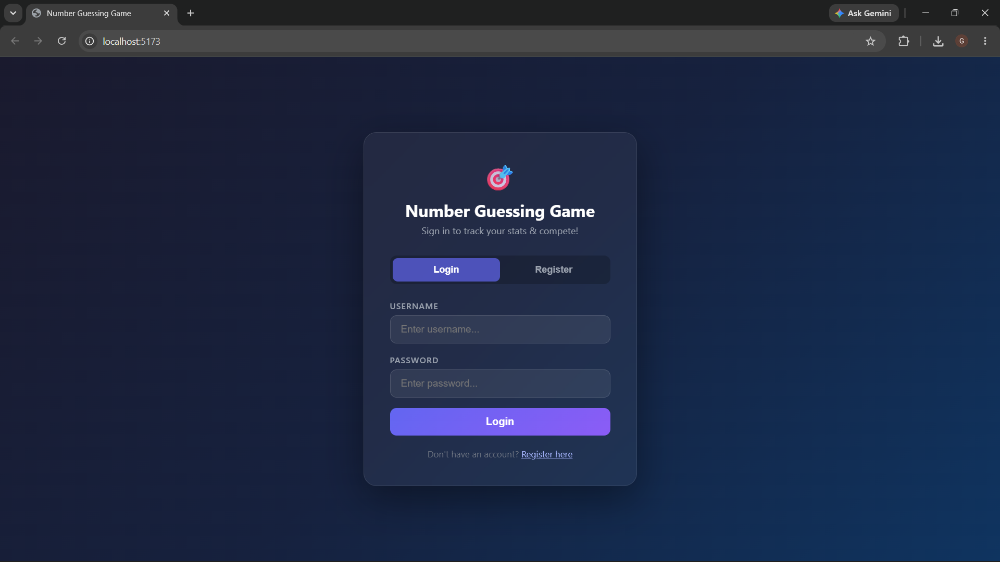
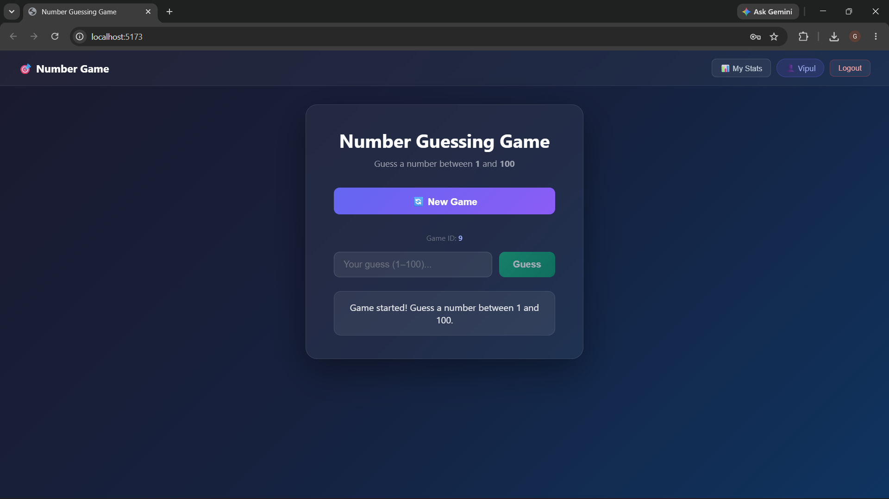
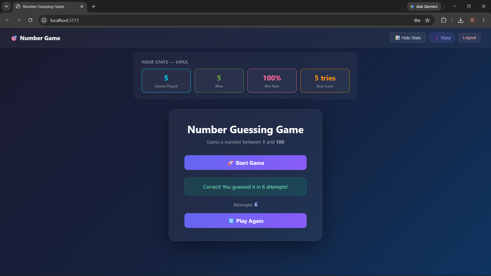
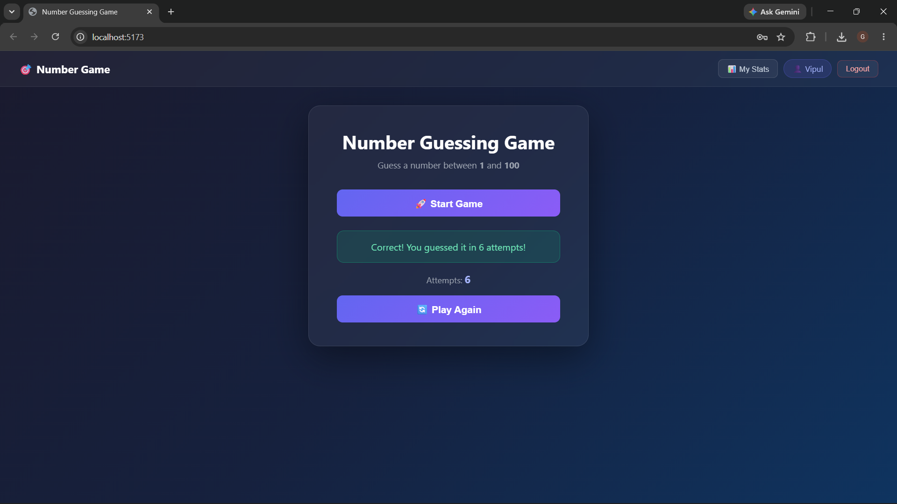

# 🎯 Number Guessing Game

A full-stack Number Guessing Game built using React, Vite, Spring Boot, and MySQL.

## 📖 About the Project

This is my first full-stack web application built as part of my learning journey in web development.

The project is a Number Guessing Game where users try to guess a randomly generated number between 1 and 100. The frontend is built with React and Vite, while the backend uses Spring Boot with MySQL to manage game data.

Through this project, I learned how to connect a React frontend with a Spring Boot backend, build REST APIs, interact with a MySQL database, and organize a full-stack application.

## ✨ Features

- 👤 User Registration and Login
- 🎮 Interactive Number Guessing Game
- 🔢 Random number generation between 1 and 100
- 💬 Instant feedback (Too High / Too Low / Correct)
- 📊 Personal statistics dashboard
- 🏆 Best score tracking
- 🔄 Play Again functionality
- 💾 Game progress stored in MySQL
- 🔗 REST API communication between frontend and backend
- 🎨 Modern responsive user interface

---

# 📸 Screenshots

## 🔐 Login & Registration

A secure authentication page where users can register or log in before playing the game.



---

## 🎮 Gameplay

Users can start a new game, enter guesses, and receive instant feedback indicating whether the guess is too high, too low, or correct.



---

## 📊 User Statistics

A personal dashboard displaying the total number of games played, games won, total guesses, and the player's best score.



---

## 🏆 Winning Screen

When the correct number is guessed, the game congratulates the player, displays the total attempts, and allows them to start a new game.



---

## 🛠️ Tech Stack

| Layer | Technology |
|-------|-----------|
| Frontend | React 18, Vite 5 |
| HTTP Client | Axios |
| Backend | Spring Boot 3.2, Java 17 |
| ORM | Spring Data JPA / Hibernate |
| Database | MySQL 8 |
| Build Tool | Maven |

## 📁 Project Structure

```
number-guessing-game/
├── frontend/                          ← React + Vite app
│   ├── index.html
│   ├── package.json
│   ├── vite.config.js
│   └── src/
│       ├── main.jsx                   ← React entry point
│       ├── App.jsx                    ← Root component
│       ├── index.css                  ← Global styles
│       ├── api/
│       │   └── gameApi.js             ← All backend API calls
│       └── components/
│           └── Game.jsx               ← Main game UI component
│
├── backend/                           ← Spring Boot app
│   ├── pom.xml                        ← Maven dependencies
│   └── src/main/
│       ├── java/com/example/numbergame/
│       │   ├── NumbergameApplication.java   ← Main entry point
│       │   ├── controller/
│       │   │   └── GameController.java      ← REST endpoints
│       │   ├── service/
│       │   │   └── GameService.java         ← Game logic
│       │   ├── repository/
│       │   │   └── GameRepository.java      ← DB access
│       │   └── model/
│       │       └── Game.java                ← Entity / DB table
│       └── resources/
│           └── application.properties       ← DB config
│
└── database-setup.sql                 ← MySQL setup script
```

---

## 🚀 How to Run

### Prerequisites
- Java 17+
- Node.js 18+
- MySQL 8+
- Maven 3.6+

---

### Step 1 — Set Up MySQL

```bash
# Log into MySQL
mysql -u root -p

# Run the setup script
source /path/to/number-guessing-game/database-setup.sql
```

Or manually:
```sql
CREATE DATABASE numbergame_db;
```

---

### Step 2 — Configure the Backend

Edit `backend/src/main/resources/application.properties`:

```properties
spring.datasource.url=jdbc:mysql://localhost:3306/numbergame_db
spring.datasource.username=root
spring.datasource.password=YOUR_MYSQL_PASSWORD   ← change this
```

---

### Step 3 — Run the Backend (Spring Boot)

```bash
cd backend
mvn spring-boot:run
```

Backend starts at: **http://localhost:8080**

---

### Step 4 — Run the Frontend (React + Vite)

```bash
cd frontend
npm install
npm run dev
```

Frontend starts at: **http://localhost:5173**

---

## 🔌 REST API Reference

### POST `/api/game/start`
Starts a new game. Generates a random number and saves it to the database.

**Response:**
```json
{
  "gameId": 1,
  "message": "Game started! Guess a number between 1 and 100."
}
```

---

### POST `/api/game/guess`
Submit a guess for an active game.

**Request Body:**
```json
{
  "gameId": 1,
  "guess": 42
}
```

**Response (Too Low):**
```json
{
  "message": "Too Low! Try a higher number.",
  "attempts": 1,
  "gameOver": false
}
```

**Response (Correct):**
```json
{
  "message": "🎉 Correct! You guessed it in 5 attempts!",
  "attempts": 5,
  "gameOver": true
}
```

---

## 🗄️ Database Schema

**Table: `game`**

| Column        | Type        | Description                        |
|---------------|-------------|------------------------------------|
| id            | BIGINT (PK) | Auto-incremented game ID           |
| random_number | INT         | The secret number (1–100)          |
| attempts      | INT         | Number of guesses made             |
| game_over     | TINYINT(1)  | 1 = game won, 0 = in progress      |

---

## 🧠 File Explanations

| File | Role |
|------|------|
| `Game.java` | JPA Entity — maps Java class to MySQL `game` table |
| `GameRepository.java` | Extends JpaRepository — provides free CRUD methods |
| `GameService.java` | Business logic — random number, guess comparison, attempt tracking |
| `GameController.java` | REST controller — maps HTTP routes to service methods |
| `gameApi.js` | Axios functions — abstracts all backend HTTP calls |
| `Game.jsx` | React component — UI state, input handling, API calls |
| `App.jsx` | Root component — renders Game inside the app shell |
| `application.properties` | Spring Boot config — DB URL, credentials, JPA settings |

---

## 🧠 What I Learned

Building this project helped me strengthen my understanding of full-stack web development. Through this project, I learned:

- Building REST APIs using Spring Boot
- Connecting a React frontend with a Spring Boot backend
- Managing data using MySQL and Spring Data JPA
- Handling user authentication and login functionality
- Organizing a full-stack project with separate frontend and backend modules
- Using Git and GitHub for version control and project management
- Debugging and testing API communication between frontend and backend

## 🚀 Future Improvements

Some features I would like to add in future versions:

- 🎮 Multiple difficulty levels
- 🌍 Global leaderboard
- 📱 Improved mobile responsiveness
- 🔐 JWT-based authentication
- 🐳 Docker support for easier deployment
